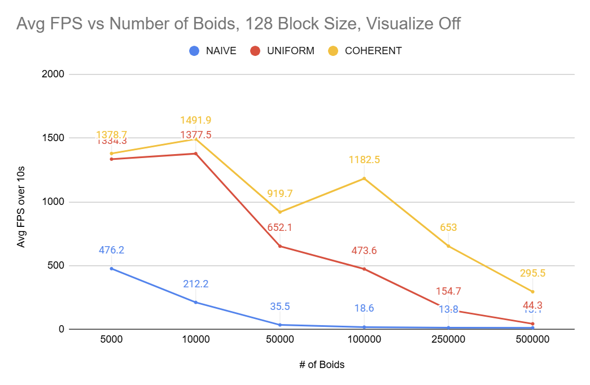
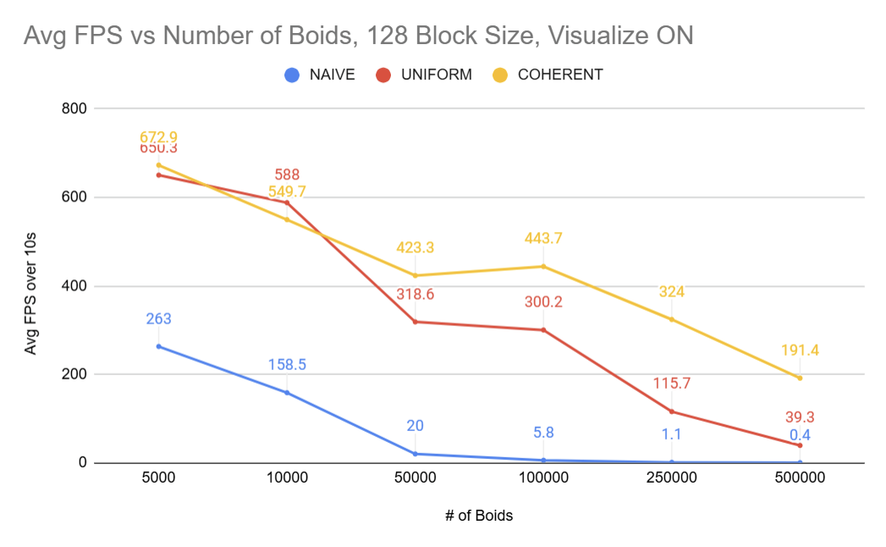
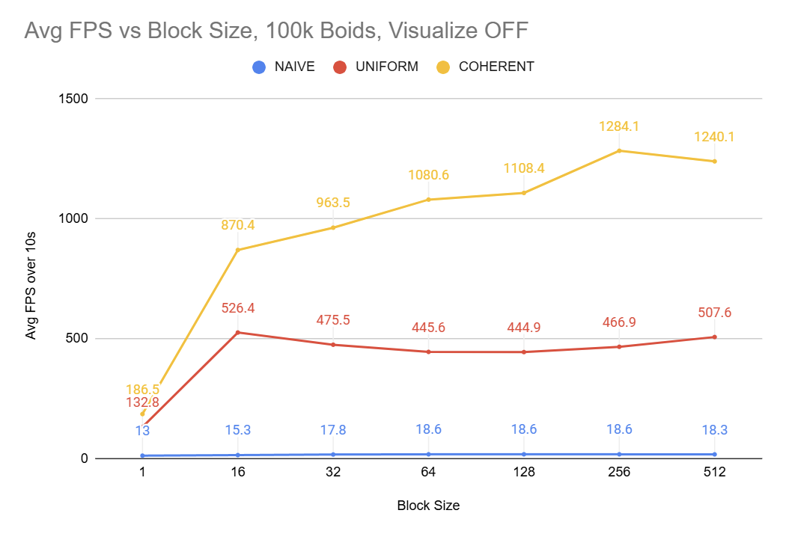
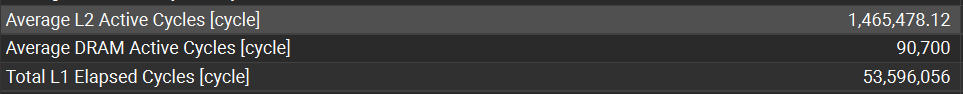
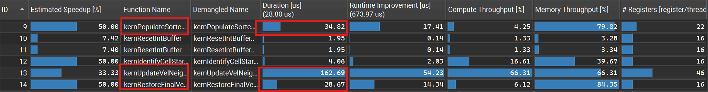
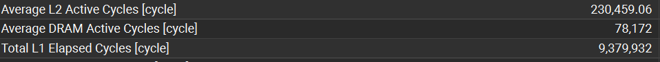

**University of Pennsylvania, CIS 5650: GPU Programming and Architecture,
Project 1 - Flocking**

* Anthony Ge
  * [LinkedIn](https://www.linkedin.com/in/anthonyge/), [personal website](https://www.geant.pro)
* Tested on: Windows 11, i9-13900H @ 2600 Mhz 16GB, NVIDIA 
GeForce RTX 4070 Laptop GPU 8GB
* **For extra credit, I implemented grid-looping optimization.**

## Project 1: CUDA-based Boids Simulation

|  |
| :--:  |
| *Naive implementation with 10,000 boids* |

|  |
| :--:  |
| *Uniform implementation with 100,000 boids* |

|  |
| :--:  |
| *Coherent implementation with 100,000 boids* |

For this assignment, I implemented a flocking simulation based on the Reynolds Boids algorithm. We call the objects in simulaiton boids, whose positions and velocities are determined by three rules representing behaviors for cohesion, separation, and alignment.

Cohesion draws groups of boids within a distance to their center of mass, separation ensures they avoid getting too close to each other, and alignment makes sure they share a relatively similar velocity.

There are overall three methods of implementation covered: naive, uniform, and coherent. 

- For Naive simulation, we dispatch a kernel running threads for each boid, where each boid will loop through every boid to calculate velocities based on the three rules. 

 - To improve upon performance in Naive, we can use a uniform grid to bin boids into 3D cells, such that for a given boid, we can spatially check neighboring cells for boids rather than checking all. To group boids into cells, we make use of key/value sorting for the grid/boid index relation and utilize buffers to store indirect indexes to position/velocity data.

 - We then reach the coherent implementation by sorting position/velocity buffers to remove the use of the indirect indices.

 We achieve the screenshot above, showing the coherent method for simulating boids in real-time.
 
## Performance Measuring
To gather FPS data, I logged the number of frames rendered over a 10 second period using data from glfw. Depending on whether or not I want to measure kernel performance from NSight Compute, I also have a preprocessor directive for toggling a frame limit before automatically terminating the boids program. 

This average FPS data is then logged to stdout. The rough pseudocode is as such for general purpose FPS logging.

```
double initTime = glfwGetTime()
double currentTime = initTime
int framesCollected = 0

while (application should run .. AND (currentTime - initTime) < 10 seconds)
{
  currentTime = glfwGetTime()
  framesCollected++

  .. run loop
}

// Alternatively, if profiling for NSight Compute, have while loop break if framesCollected > 5 to ensure consistent kernels logged.

print(avg FPS: framesCollectedd / 10)
```

Data was then collected and logged in a spreadsheet, detailing performance vs. boid size, block size, and whether or not we're rendering boids.

## Peformance Analysis/Questions:
### For each implementation, how does changing the number of boids affect performance, why do you think that is?




Generally across all three methods of implementation, the performance decreased as number of boids increased. The simplest explanation is that increasing boid count requires us to process more boids by using more threads, and in doing so this also requires us to allocate more device memory. 

Each thread will also have more work by needing to process other boids, which is increased. Therefore, each thread does more work too. This is particularly harmful for the **Naive implementation** since each thread needs to check O(n) boids, which scales very poorly. Thus, naive scales like a curve.

**For Coherent/Uniform,** the performance drop isn't as dramatic as the naive because we check a constant number of cells, but per cell the number of boids is still generally larger.

Depending on whether or not the number of boids is a multiple of our block size, this can impact the number of blocks ran too. 

Since increasing the number of boids means we need to render more objects, we can see lower performance for visualize on versus off.

---
### For each implementation, how does changing the block count and block size affect performance? Why do you think this is?

Block size seemed generally improved performance as we increased count from 1-32 across all methods of implementation, but overall flattened for uniform and naive. Coherent, on the otherhand, seemed to perform just a little bit better as we increased block size past 32, but more importantly its rate of improvement paled by comparison to 1-32.

This can be attributed to the 32 thread warp size on our GPU cards, as warp sizes in multiples of 32 will perform similarly since each block won't have any unutilized threads. This is noted as well with our block size of 16, where many threads are under-utilized, showing the performance hit in naive and coherent (though somehow uniform did better across multiple tests...).

---
### Did you experience any performance improvements with the more coherent uniform grid? Was this the outcome you expected? Why or why not?

The performance improvements for coherent were very clear as our boid count increased. Across all tests for boid size, coherent always performed better than uniform.

I did expect an improvement in performance, but I did not think it would be this significant, as I figured reducing 2 memory reads per cell check can only do so much and the potential overhead of reshuffling our buffers could also hurt performance too. 

However, I was very wrong! While reducing two memory reads per neighbor check to find indices can be helpful, I think the more important improvement comes from the **contiguous memory in cache** when we do access pos/vel data per boid in a grid. This therefore results in better cache coherency and hits, unlike the previous model where indexing into unordered pos/vel will be in random positions of our 1D buffers, which definitely scales horribly. 

To verify my assumption, I used **NSight Compute** to analyze kernel durations and active/average L1/L2 cycles.

**For uniform, observe the screenshots analyzing kernel duration and L1/L2 cycles:**



Through the screenshots, we can see kernel ```kernUpdateVelNeighborSearchScattered``` run for 947us, which is ~1ms. This is for our uniform implmentation without any reshuffling and middle-man cuts. Our L2 and L1 cache cycles are also high in the millions. 

Upon switching to coherent, our overall kernel durations and L1/L2 cycles are significantly lower, even though we practically changed nothing in the coherent neighbor kernel code!



**Average L2 Active Cycles reduced by ~6.36x,** which is an incredible improvement. Our L1 cycles have also been reduced, most likely due to better cache performance from our reshuffled buffers.

We can easily see that the **combined ```34.82us + 162.69us + 28.67us = 226.18us``` cost is significantly cheaper than ```947.04us```,** meaning our reshuffling kernel and restoring original orders is well worth the additional overhead.

---
### Did changing cell width and checking 27 vs 8 neighboring cells affect performance? Why or why not? Be careful: it is insufficient (and possibly incorrect) to say that 27-cell is slower simply because there are more cells to check!

For testing 100k boids, I interestingly saw performance increases for both uniform and coherent, with/without visualization on. 

|          | 8 Cells, 2x neighbor dist. cell width, Viz OFF | 27 Cells, 1x neighbor dist. cell width, Viz OFF |
|----------|---------------------------------------|----------------------------------------|
| Uniform  | 473.6                                 | 576.2                                  |
| Coherent | 1182.5                                | 1143.5                                 |

|          | 8 Cells, 2x neighbor dist. cell width, Viz ON | 27 Cells, 1x neighbor dist. cell width, Viz ON |
|----------|---------------------------------------|----------------------------------------|
| Uniform  | 300.2                                 | 338.2                                  |
| Coherent | 443.7                                | 553.2                                 |

This particularly surprised me, as I expected that the more cell checks would hurt performance, as it could increase the chances of thread stalls in a warp if one thread in particular scanned through 27 cells when all others didn't - implying that the work to scan 27 vs 8 is much more and more likely to happen.

It's likely the case that by reducing the cell width, we're more likely to skip through more empty cells, which can boost thread performance. Contrasting before, the higher neighborhood size from using 2x distance for a cell width means that each grid cell will contain much more boids, which are also similarly much more likely to **NOT** be in the neighborhood range. 

Therefore, we are more likely to process more out of range boids with 2x width cells than the 27 cells configuration with a normal width. By having less boids to process in the 27 cell check, we're potentially boosting performance as each thread can skip more cells and do less work overall.


